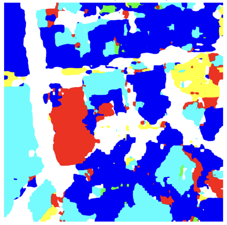
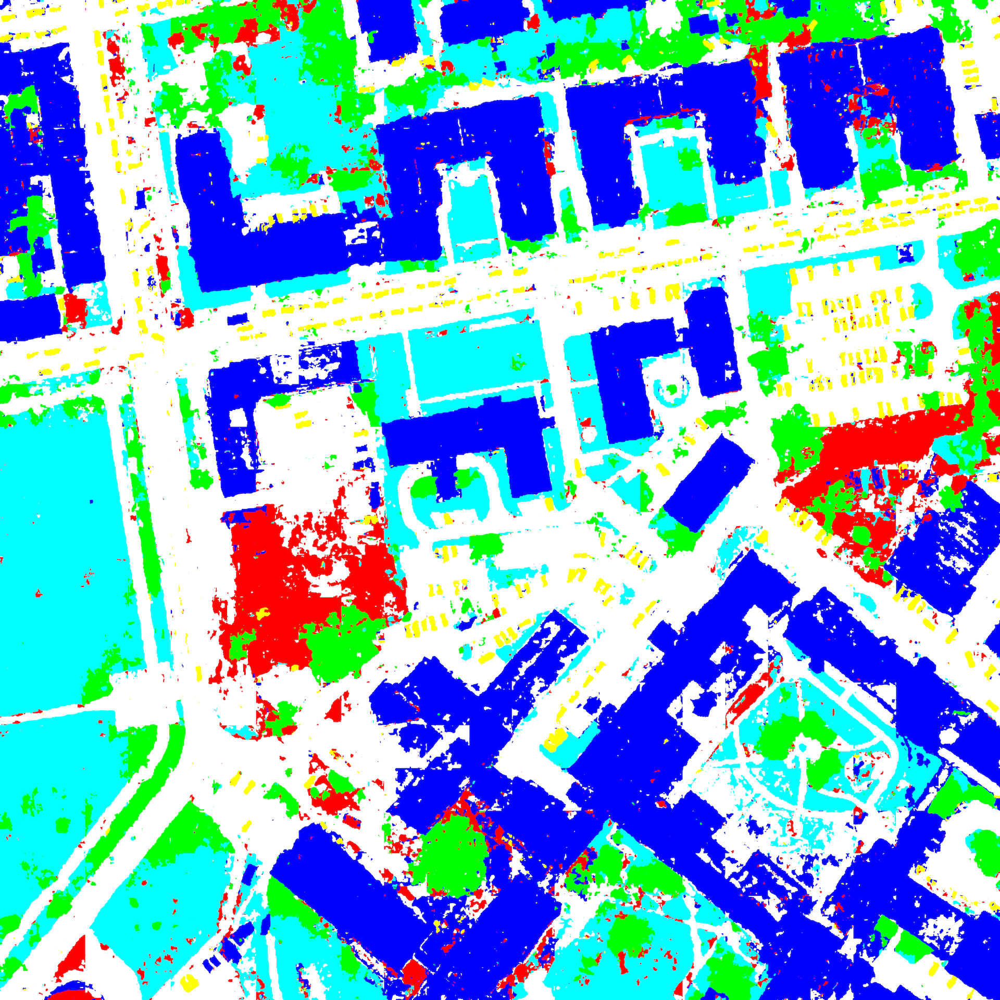

# RSKT-Seg Inference on ISPRS Potsdam Dataset

This repository contains an optimized inference pipeline for evaluating the **RSKT-Seg** (Remote Sensing Knowledge Transfer Segmentation) Vision Transformer model on the high-resolution **ISPRS Potsdam** dataset. 

This project is formatted as a Jupyter Notebook (`.ipynb`) to serve as a visual, step-by-step tutorial. It demonstrates how to handle massive $6000 \times 6000$ satellite images efficiently without running out of GPU memory.

## Performance Breakthrough: Sliding Window vs. Direct Inference

Zero-shot open-vocabulary models often struggle with massive satellite imagery because squishing a $6000 \times 6000$ image into a standard AI input size destroys critical pixel data. 

* **Baseline Performance:** In the original RSKT-Seg paper, standard evaluation on the Potsdam dataset yielded a mean Intersection over Union (mIoU) of **~38%**. (Check the rskt-postdam-baseline.ipynb)
* **Improved Performance:** By engineering a high-overlap sliding window inference loop, the Vision Transformer can natively evaluate high-resolution patches. This pipeline boosts the mIoU to **>65%** without retraining or fine-tuning a single weight. (Check the rskt_postdam.ipynb)

---

## Key Engineering Features
* **Zero-Copy Data Pipeline:** Uses Linux symbolic links (`ln -sf`) to map heavy `.pth` weights and `.tif` images from read-only directories in milliseconds, saving massive amounts of RAM.
* **Sliding Window Inference:** Processes large images safely using a 512x512 sliding window with a 50% overlap, seamlessly stitching and averaging predictions to avoid border errors and drastically improve mIoU.
* **Vectorized Mask Translation:** Converts human-readable RGB ground truth masks into machine-readable integer classes instantly using NumPy vectorization.
* **Lightning-Fast Evaluation:** Implements a flat-array hash function to calculate the Confusion Matrix and IoU across 36 million pixels in seconds.

---

## How to Run This Code (Kaggle Setup)

This pipeline is built natively for Kaggle. To run this notebook yourself, follow these steps:

### 1. Hardware Configuration
* Import this `.ipynb` file into a new Kaggle Notebook.
* Open the right-hand panel, navigate to **Session Options**, and set the **Accelerator** to a GPU (e.g., **GPU P100** or **GPU T4 x2**). 
* Ensure **Internet access** is turned on so the script can clone the required Detectron2 and RSKT-Seg repositories.

### 2. Attaching the Dataset
If you are starting from scratch or using a different environment, you must build the dataset folder yourself. Create a new dataset named `rskt-potsdam-test-data` containing the following:
1. **`rskt-weights/`**: A folder containing the required pre-trained Vision Transformer and CLIP weights. You will need to source these from their respective official releases:
   * `model_final.pth` & `RSIB.pth`: Provided by the official [RSKT-Seg Authors](https://github.com/LiBingyu01/RSKT-Seg_and_Pi-Seg).
   * `RemoteCLIP-ViT-B-32.pt`: Provided by the official [RemoteCLIP repository](https://github.com/ChenDelong/RemoteCLIP).
   * `ViT-B-16.pt`, `ViT-B-32.pt`, `ViT-L-14-336px.pt`: Standard OpenAI CLIP weights.
2. **Raw Imagery**: The uncompressed `*_RGB.tif` files from the official ISPRS Potsdam benchmark, placed in the root folder.
3. **Ground Truth Masks**: The corresponding `*_label_noBoundary.tif` masks from ISPRS, also in the root folder.

*Ensure you update the `SOURCE` path variables in the notebook cells to point to your new dataset directory.*

---

## Pipeline Overview

When you run the notebook, it executes the following stages:
1. **Engine Initialization:** Clones the RSKT-Seg architecture and adjusts dependency versions to prevent Kaggle environment crashes.
2. **Dataset Linking & Code Hacking:** Alters the original `register_Potsdam.py` code in-place to accept `.tif` files instead of `.png` files, bypassing the need to re-encode the dataset.
3. **Matrix Generation:** Translates the RGB labels into a 6-class integer map (Impervious surfaces, Buildings, Low vegetation, Trees, Cars, and Clutter).
4. **Sliding Window Execution:** Slices the images, translates the AI's native 17-class predictions down to 6 classes, and outputs color-coded segmentation `.png` maps.
5. **Metric Calculation:** Calculates Accuracy, Precision, Recall, and IoU, utilizing safety shields against zero-division errors for images missing specific classes.

---

## Visual Results

**| Original Image | Ground Truth Mask | RSKT-Seg Prediction (Baseline) | RSKT-Seg Prediction (Ours) |**
|---|---|---|
|  |  |  |  |

---

## Acknowledgments
* **Original Architecture & Paper:** *Exploring Efficient Open-Vocabulary Segmentation in the Remote Sensing* (AAAI 2026). [Read the ArXiv Paper](https://arxiv.org/abs/2509.12040).
* **Original Codebase:** [LiBingyu01/RSKT-Seg_and_Pi-Seg](https://github.com/LiBingyu01/RSKT-Seg_and_Pi-Seg)
* **Dataset Base:** ISPRS 2D Semantic Labeling Contest - Potsdam.
